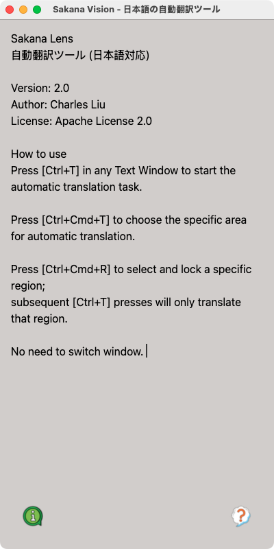
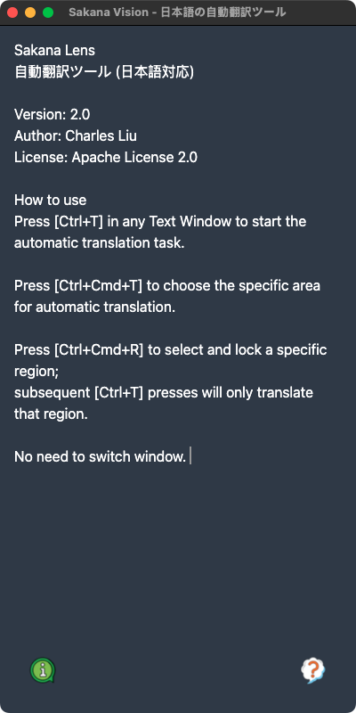
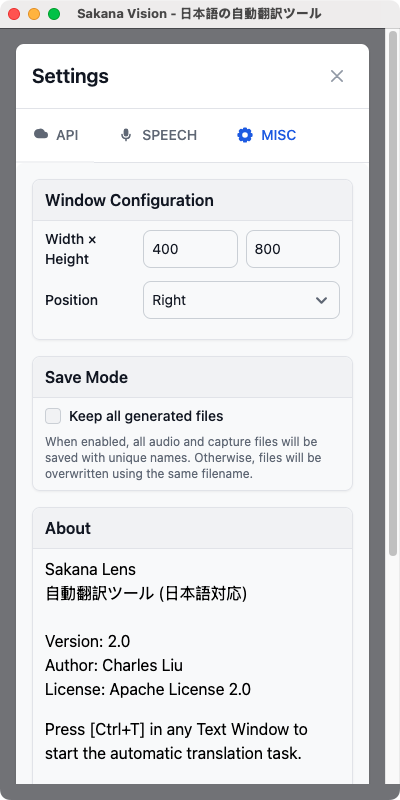

# SakanaVision - A New Version of SakanaLens


## Automatic Japanese-to-English Translation

**SakanaVision** enables seamless translation of Japanese text to English in any active window. With a simple **Ctrl + T** shortcut for full-window translation, **Ctrl + Cmd + T** to select a specific area, or **Ctrl + Cmd + R** to lock a region for future translations (then using **Ctrl + T** to translate only that region), you can translate on-screen text without switching applications.

---

## ✨ Features
- **Instant Translation**: Press **Ctrl + T** to trigger translation of the entire active window. :zap:
- **Selective Translation**: Use **Ctrl + Cmd + T** to select a specific area or scope for translation, instead of the whole window. :scissors:
- **Region Lock Translation**: Press **Ctrl + Cmd + R** to select or define a specific region for translation. The app will remember this region, and subsequent **Ctrl + T** presses will only translate text within that locked region. :lock:
- **Stay Focused**: No need to leave the app you're using. :eyes:
- **Screen Text Detection**: Automatically translates visible text in the active application. :mag:
- **Speech Support**: Converts translated text into speech (English & Chinese only, via Alibaba DashScope). :sound:
- **Local Text-to-Speech (TTS)**: Support kokoro tts model, using local tts without token consumption. :speech_balloon:

---

## 🚀 Installation & Setup
### **Step 1: Download and Extract **
- Download the .7z file under the release page.

### **Step 2: Grant Accessibility Permissions**
To function properly, SakanaVision requires accessibility permissions.
- Open **System Preferences** → **Privacy & Security** → **Accessibility**.
- Add either the app or the terminal if running from the command line.

### **Step 3: Set Up API Key**
- Press **Cmd/Ctrl + .** or Click the left corner button to open the settings.

### **Step 4: Run the Application**
- Press **Ctrl + T** to trigger translation.

---

## ⚠️ Compatibility

**SakanaVision is currently only supported on macOS.**

> **Note:**  
> - This app **CANNOT** run on Windows.  
> - You **MUST** grant **Accessibility permissions** for the app or terminal.  
> - You **MUST** grant **Screen and System Audio Recording permissions** for the app or terminal.  
> These permissions are required under **Privacy & Security settings** because the app needs access to the screen for clipping and screenshots, as well as system audio output.

---

## 🎤 Text-to-Speech (TTS) Support
- Utilizes **Alibaba DashScope** for TTS.
- Supports **English and Chinese**.
- **Japanese TTS is not supported**.
- **Note:** Using DashScope for TTS consumes tokens, which may incur costs.

---

## 🟢 New UI | 🎉 Version 2.0 released 

| Light Mode | Dark Mode | Settings |
|------------|------------|------------|
|  |  |  |


---

## 📺 Showcase
### **🔎 Webpage Translation**
Translate website text into English effortlessly. 🛜
[](https://www.youtube.com/watch?v=sbTPrqqoixQ)

### **📖 Manga Translation with Speech**
Experience manga translation with text-to-speech functionality. 💬
[](https://www.youtube.com/watch?v=fpw661mpBYI)

#### **Gaming Support**


---

## 🛠️ Contribution & Support
Feel free to contribute to this project! If you encounter issues, please open an [issue](https://github.com/Activebook/SakanaVision/issues) or submit a pull request.

Happy translating! 🎉

--- 

```json
{
  "name": "Sakana Vision",
  "description": "自動翻訳ツール (日本語対応)",
  "version": "2.0",
  "author": "Charles Liu",
  "license": "Apache-2.0",
  "system_requirements": {
    "os": "macOS only"
  }
}